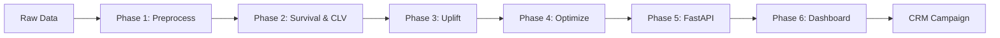

```markdown
# 🚀 EcomOpti: Telco Churn & CLV Optimization Platform

**A 6-phase production ML pipeline for customer retention campaign optimization with interactive decision dashboard.**

---

## 📋 Table of Contents
- [Project Overview](#project-overview)
- [Architecture](#architecture)
- [Installation](#installation)
- [Quick Start](#quick-start)
- [Phase Guide](#phase-guide)
- [Directory Structure](#directory-structure)
- [Configuration](#configuration)
- [Troubleshooting](#troubleshooting)

---

## 🎯 Project Overview

EcomOpti is an end-to-end machine learning platform that predicts customer churn, estimates Customer Lifetime Value (CLV), and optimizes retention campaign budgets using causal inference. It provides a Power BI-style interactive dashboard for business users to run "what-if" scenarios without writing code.

**Key Capabilities:**
- **Phase 1**: Data preprocessing with leakage prevention & stratified splitting
- **Phase 2**: Survival analysis (Cox/RSF) + CLV modeling
- **Phase 3**: Causal uplift modeling (S-Learner + DR-Learner + Ensemble)
- **Phase 4**: Budget-constrained knapsack optimization (Greedy + ILP)
- **Phase 5**: FastAPI microservice for pipeline orchestration
- **Phase 6**: Interactive Dash dashboard with click-to-filter, scenario analysis & CRM exports

---

## 🏗️ Architecture



**Data Flow**: Raw CSV → Cleaned → Survival Probabilities → Treatment Effects → Optimal Selection → API → Dashboard → Export

---

## ⚙️ Installation

### **Prerequisites**
- Python 3.9+
- pip or conda
- Windows/Linux/macOS

### **1. Clone & Setup**
```bash
git clone <repository-url>
cd ecomopti
python -m venv venv
source venv/bin/activate  # Linux/Mac
# or
venv\Scripts\activate     # Windows
```

### **2. Install Dependencies**
```bash
# Core ML pipeline (Phases 1-4)
pip install -r requirements.txt

# Phase 5 API
pip install fastapi>=0.104.0 uvicorn[standard]>=0.24.0 pydantic>=2.0.0 python-multipart==0.0.6 requests>=2.28.0

# Phase 6 Dashboard
pip install dash==2.14.2 dash-bootstrap-components==1.5.0 plotly==5.18.0
```

### **3. Verify installation**
```bash
python -c "import sksurv; import lifelines; print('✅ Core ML OK')"
python -c "import fastapi; import uvicorn; print('✅ API OK')"
python -c "import dash; import plotly; print('✅ Dashboard OK')"
```

---

## 🚀 Quick Start

### **Step 1: Start API (Terminal 1)**
```bash
python run_api.py
```
**Expected**: Swagger UI at `http://localhost:8000/docs`

### **Step 2: Start Dashboard (Terminal 2)**
```bash
python run_dashboard.py
```
**Expected**: Dashboard at `http://localhost:8050`

### **Step 3: Run Optimization**
1. Open browser to `http://localhost:8050`
2. Select `test` split, `ensemble` model
3. Set budget `$2,500`
4. Click **"Run Optimization"**
5. View Financial Impact & Download CSV

---

## 📚 Phase Guide

### **Phase 1: Data Foundation**
```bash
python -m src.ecomopti.phase1.pipeline
```
**Output**: `data/splits/{train,val,test}.csv`, `artifacts/phase1/*`

### **Phase 2: Survival & CLV**
```bash
python -m src.ecomopti.phase2.build
```
**Output**: Cox/RSF models, CLV predictions, `models/phase2/*`

### **Phase 3: Uplift Modeling**
```bash
python -m src.ecomopti.phase3.build --model ensemble
```
**Output**: `models/phase3/ensemble_pred_*.npy`

### **Phase 4: Optimization**
```bash
python -m src.ecomopti.phase4.build --split test --model ensemble --budget 2500
```
**Output**: `data/phase4/crm_export_test_ensemble_2500.csv`

### **Phase 5: API Service**
```bash
python run_api.py
```
**Endpoints**: `/pipeline/run`, `/phase4/optimize`, `/health`

### **Phase 6: Dashboard**
```bash
python run_dashboard.py
```
**Pages**: Campaign Builder, Historical Campaigns, Model Performance, Settings

---

## 📁 Directory Structure

```
ecomopti/
├── data/
│   ├── raw/                  # telco.csv
│   ├── splits/               # {train,val,test}.csv
│   └── phase4/               # crm_export, enriched data
├── artifacts/
│   ├── phase1/               # preprocessors, manifests
│   └── phase2/               # CLV predictions
├── models/
│   ├── phase2/               # cox, rsf, clv models
│   └── phase3/               # uplift predictions
├── plots/
│   ├── phase2/               # matplotlib PNGs
│   └── phase4/               # campaign visualizations
├── reports/
│   └── phase4/               # JSON metrics, markdown
├── logs/
│   ├── dashboard.log         # Phase 6 activity
│   └── pipeline_*.log        # Phase 5 background jobs
├── src/ecomopti/
│   ├── phase1/               # config, pipeline, preprocess
│   ├── phase2/               # build, train, eval, plots
│   ├── phase3/               # causal inference
│   ├── phase4/               # optimization
│   ├── phase5/               # FastAPI service
│   └── phase6/               # Dash dashboard
├── requirements.txt          # Core dependencies
├── run_api.py               # Launch Phase 5
├── run_dashboard.py         # Launch Phase 6
└── README.md                # This file
```

---

## 🔧 Configuration

### **Environment Variables**
```bash
export ECOMOPTI_API_URL="http://localhost:8000"  # For dashboard
export PYTHONPATH="${PWD}/src"                    # For module imports
```

### **Phase 4 Business Rules** (`src/ecomopti/phase4/config.py`)
```python
TREATMENT_COST_NEW = 15.0      # New customers
TREATMENT_COST_MID = 10.0      # 1-3 years tenure
TREATMENT_COST_LONG = 8.0      # 3+ years tenure
TARGET_FRACTION = 0.20         # Top 20% for campaigns
```

---

## 🐛 Troubleshooting

### **Issue**: `UnboundLocalError: y_random referenced before assignment`
**Fix**: Update `plotly_factory.py` with the corrected cumulative gain function (see Phase 6 code review)

### **Issue**: Dashboard shows "API Offline"
**Solution**: 
```bash
# Check API health
curl http://localhost:8000/health
# Restart API if needed
python run_api.py
```

### **Issue**: Phase 4 enriched data not found (fallback warning)
**Solution**: Run Phase 4 optimizer first:
```bash
python -m src.ecomopti.phase4.build --split test --model ensemble --budget 2500
```

### **Issue**: Import errors on Windows
**Solution**: Use absolute imports or set PYTHONPATH:
```powershell
$env:PYTHONPATH = "D:\myproject\ecomopti\src"
```

---

## 📊 Performance Notes

- **LRU Caching**: Dashboard caches up to 32 data loads for 10x faster refreshes
- **Decimation**: Plots automatically downsample >2,000 customers for smooth interactivity
- **API Timeouts**: Default 30s timeout; increase for budgets >$10,000
- **Memory**: Dashboard uses ~500MB RAM; API uses ~1GB when processing

---

## 🛡️ Production Deployment

### **API (Phase 5)**
```bash
# Use gunicorn instead of uvicorn --reload
gunicorn -w 4 -k uvicorn.workers.UvicornWorker src.ecomopti.phase5.main:app
```

### **Dashboard (Phase 6)**
```bash
# Disable debug mode
app.run(debug=False, dev_tools_hot_reload=False)
```

### **Security**
- Add API key authentication
- Use HTTPS with reverse proxy (nginx)
- Restrict dashboard access with VPN

---

## 📄 License & Attribution

Built with:
- **Survival Analysis**: `lifelines`, `scikit-survival`
- **Causal Inference**: `econml`, `causalml`
- **API**: `FastAPI`, `uvicorn`
- **Dashboard**: `Dash`, `Plotly`, `Bootstrap`
- **Data Validation**: `pandera`

---

## 🤝 Contributing

1. Fork repository
2. Create feature branch (`git checkout -b feature/awesome`)
3. Run tests: `pytest tests/`
4. Format code: `black src/`
5. Submit PR with detailed description

---

## 📞 Support

For issues, see [TROUBLESHOOTING.md](docs/TROUBLESHOOTING.md) or open a GitHub issue.

**Happy optimizing! 🎯**
```